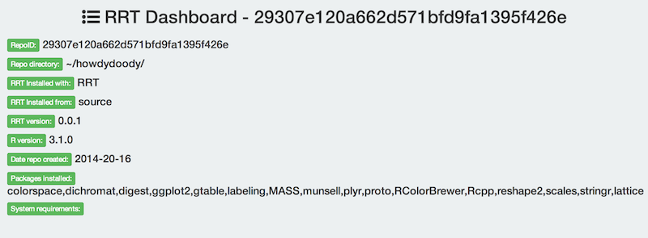

```r
library("RRT")
```

### <a href="#createrrt" name="createrrt">#</a> Create an RRT repository

#### <a href="#nouserinput" name="nouserinput">#</a> Create a repo without user input

```r
rrt_init("~/mynewrepository")
```

You should now have a RRT repository

#### <a href="#userinput" name="userinput">#</a> Or create a repo interactively

This process will ask you questions

```r
rrt_init(interactive=TRUE)
```

With similar message as above for other checks

### <a href="#refresh" name="refresh">#</a> Refresh repository

`rrt_refresh()` is used to update the packages installed locally in your repository by looking through the repository files again for new packages.
After we initiated a new repo above with `rrt_init()` we may add some code in a `code.R` file.
Then we want to update the packages in the repo, which can be done with `rrt_refresh()`.

```r
rrt_refresh("~/mynewrepository")
```

As you can see `rrt_refresh()` scans the repo for new packages used, downloads them if any new ones, and updates the manifest file.

### <a href="#installpkgs" name="installpkgs">#</a> Install packages

`rrt_init()` and `rrt_refresh()` do not install any packages. Packages are downloaded, but not installed yet. The installation process is separate on purpose, but if needed could become part of the initialization and/or refresh functions.

`rrt_install()` installs packages into the repository itself

```r
rrt_install("~/mynewrepository")
```


### <a href="#compatibility" name="compatibility">#</a> Package compatibility check

This will be done by `rrt_compat()` - this function is not done yet...

### <a href="#browsing" name="browsing">#</a> Browse your RRT repositories

This function uses `rrt_repos_list()` (see below) internally, and uses the `whisker` R package to build a series of web pages to easily understand what RRT repos exist on your machine, their details, etc.

```r
rrt_browse()
```

Should open up a web page in your default browser


You can click on each green button to get to more detailed data for each repository




### <a href="#listing" name="listing">#</a> Get a list of repositories within R

```r
rrt_repos_list()
```

```r
rrt_repos_list()[[1]]
```


### <a href="#starting" name="starting">#</a> Starting R from a repo

If you start R from a RRT repository R will use the repository specific `.Rprofile` file and look for packages in the repository to install instead of the global R packages library.

### <a href="#mran" name="mran">#</a> Get packages from MRAN

Note: this doesn't install them, only downloads them.

```r
pkgs_marmoset(pkgs=c("plyr","ggplot2"), outdir="~/marmoset_snaps/stuff/")
```

Snapshots are done a number of times each day, so a date input is used to check what snapshots are available for that date. If there is more than one, the options are listed, and you press the number of the row that corresponds to the snapshot you want to use. Then `rsync` is used to download the package(s) to the directory you specify in the `outdir` parameter. Currently, you have to specify package and version number as `package_ver`.

### <a href="#clean" name="clean">#</a> Clean

You can clean out all package sources and installed packages from your repository with a single easy to use function: `rrt_sweep()`. This defaults to work from your current working directory, and deletes all package sources and installed packages. This basically creates a clean slate in your `rrt/` directory in your respository. Your manifest file is unchanged though to retain metadata important to replication of your efforts.


```r
rrt_sweep()
```

This leaves you with all your personal files, your `rrt/` directory, and your manifest file intact.