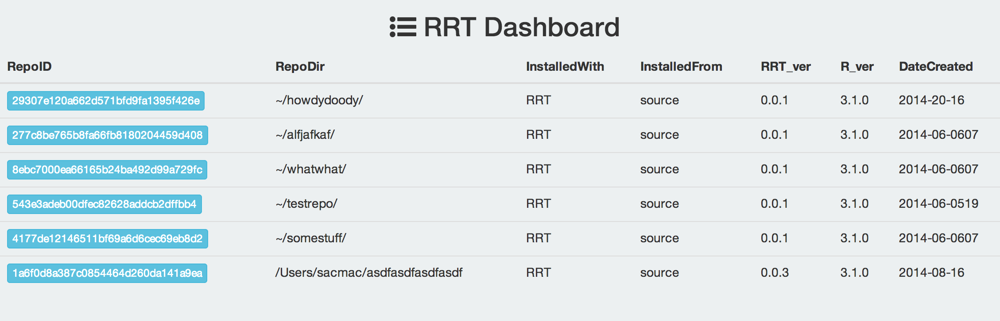
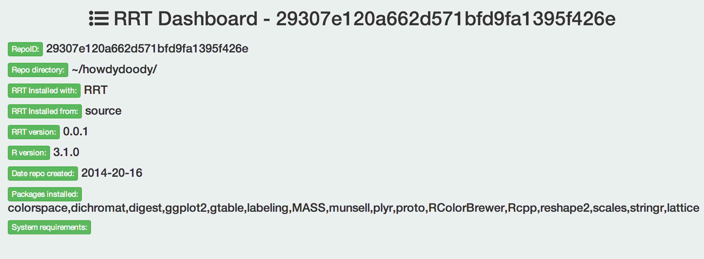

<!--
%\VignetteEngine{knitr::knitr}
%\VignetteIndexEntry{RRT vignette}
-->

RRT vignette
======

### Install RRT


```r
install.packages("devtools")
library("devtools")
devtools::install_github("RevolutionAnalytics/RRT")
```

Load `RRT`


```r
library("RRT")
```

### Create an RRT repository

#### Create a repo without user input


```r
rrt_init("~/onemorerepo")
```

```
## Checking to see if repository exists already...
## Checing to make sure rrt directory exists inside your repository...
## Creating rrt directory ~/onemorerepo/rrt/lib/x86_64-apple-darwin13.1.0/3.1.0
## Looking for packages used in your repository...
## Writing repository manifest...
## 
## >>> RRT initialization completed.
```

You should now have a RRT repository

#### Or create a repo interactively

This process will ask you questions


```r
rrt_init(interactive=TRUE)
```

With similar message as above for other checks

### Refresh repository

`rrt_refresh()` is used to update the packages installed locally in your repository by looking through the repository files again for new packages. After we initiated a new repo above with `rrt_init()` we may add some code in a `code.R` file. Then we want to update the packages in the repo, which can be done with `rrt_refresh()`.


```r
rrt_refresh("~/onemorerepo")
```

```
## Checking to make sure repository exists...
## Checing to make sure rrt directory exists inside your repository...
## Looking for packages used in your repository...
## Getting new packages...
## Writing repository manifest...
## 
## >>> RRT refresh completed.
```

As you can see `rrt_refresh()` scans the repo for new packages used, downloads them if any new ones, and updates the manifest file.

### Install packages

`rrt_init()` and `rrt_refresh()` do not install any packages. Packages are downloaded, but not installed yet. The installation process is separate on purpose, but if needed could become part of the initialization and/or refresh functions.

`rrt_install()` installs packages into the repository itself


```r
rrt_install("~/onemorerepo")
```

```
## Checking to make sure repository exists...
## Checing to make sure rrt directory exists inside your repository...
## Looking for packages used in your repository...
## Getting new packages...
## No packages found to install
```

### Package compatibility check

This will be done by `rrt_compat()` - this function is not done yet...

### Browse your RRT repositories

This function uses `rrt_repos_list()` (see below) internally, and uses the `whisker` R package to build a series of web pages to easily understand what RRT repos exist on your machine, their details, etc.


```r
rrt_browse()
```

Should open up a web page in your default browser



You can click on each green button to get to more detailed data for each repository



### Get a list of repositories within R

All repositories on your machine


```r
rrt_repos_list()
```

```
## Number of RRT repos: 16 
## 
## RRT repos : 
## 
##                                                   path
## 1                   ~/howdydoody//rrt/rrt_manifest.txt
## 2                    ~/alfjafkaf//rrt/rrt_manifest.txt
## 3                     ~/whatwhat//rrt/rrt_manifest.txt
## 4                     ~/testrepo//rrt/rrt_manifest.txt
## 5                    ~/somestuff//rrt/rrt_manifest.txt
## 6  /Users/sacmac/asdfasdfasdfasdf/rrt/rrt_manifest.txt
## 7       /Users/sacmac/somenewrepo/rrt/rrt_manifest.txt
## 8             /Users/sacmac/beans/rrt/rrt_manifest.txt
## 9                    ~/legomyrepo/rrt/rrt_manifest.txt
## 10                  ~/onemorerepo/rrt/rrt_manifest.txt
## 11         /Users/sacmac/testrepo/rrt/rrt_manifest.txt
## 12         /Users/sacmac/anewrepo/rrt/rrt_manifest.txt
## 13         /Users/sacmac/heythere/rrt/rrt_manifest.txt
## 14                 ~/somethingnew/rrt/rrt_manifest.txt
## 15                           /Users/sacmac/newmanifest
##                              repoid
## 1  29307e120a662d571bfd9fa1395f426e
## 2  277c8be765b8fa66fb8180204459d408
## 3  8ebc7000ea66165b24ba492d99a729fc
## 4  543e3adeb00dfec82628addcb2dffbb4
## 5  4177de12146511bf69a6d6cec69eb8d2
## 6  1a6f0d8a387c0854464d260da141a9ea
## 7  0b34a89dda7b251d24c39fd90bf9881c
## 8  af25ed8693f5d69e539dc118268ccbf0
## 9  1944a6826bee36f5925f1d13f11c6dc6
## 10 704f6ace5fb5703ea7058fd219cc95d3
## 11 543e3adeb00dfec82628addcb2dffbb4
## 12 ae8b9eaca9c68168b2dac7212bee47d5
## 13 db54771f0654d019ba7b1d9948d35442
## 14 9658990759fde6802982f8536bcea3d9
## 15 e3912e3cf041f1f9b0b7a38f642a3d33
## 
## 
## RRT repos in .rrt file, but repo not found: 
## 
##                                     path                           repoid
## 1 ~/mynewrepository/rrt/rrt_manifest.txt 837809181e43446a37f550c0ef38c125
## 
## 
## Heads up -> To get details for a single RRT repo: rrt_repos_list('<repoid>')
```

Get details for a single repository


```r
rrt_repos_list()[[1]]
```

```
## $repo
## [1] "~/howdydoody//rrt/rrt_manifest.txt"
## 
## $InstalledWith
## [1] "RRT"
## 
## $InstalledFrom
## [1] "source"
## 
## $RRT_version
## [1] "0.0.1"
## 
## $R_version
## [1] "3.1.0"
## 
## $DateCreated
## [1] "2014-20-16"
## 
## $PkgsInstalledAt
## [1] "/Users/sacmac/howdydoody//rrt/lib/x86_64-apple-darwin13.1.0/3.1.0"
## 
## $RepoID
## [1] "29307e120a662d571bfd9fa1395f426e"
## 
## $Packages
## [1] "colorspace,dichromat,digest,ggplot2,gtable,labeling,MASS,munsell,plyr,proto,RColorBrewer,Rcpp,reshape2,scales,stringr,lattice"
## 
## $SystemRequirements
## [1] ""
## 
## $repo_root
## [1] "~/howdydoody//rrt/rrt_manifest.txt"
## 
## $missing
## [1] FALSE
```

### Starting R from a repo

If you start R from a RRT repository R will use the repository specific `.Rprofile` file and look for packages in the repository to install instead of the global R packages library.
